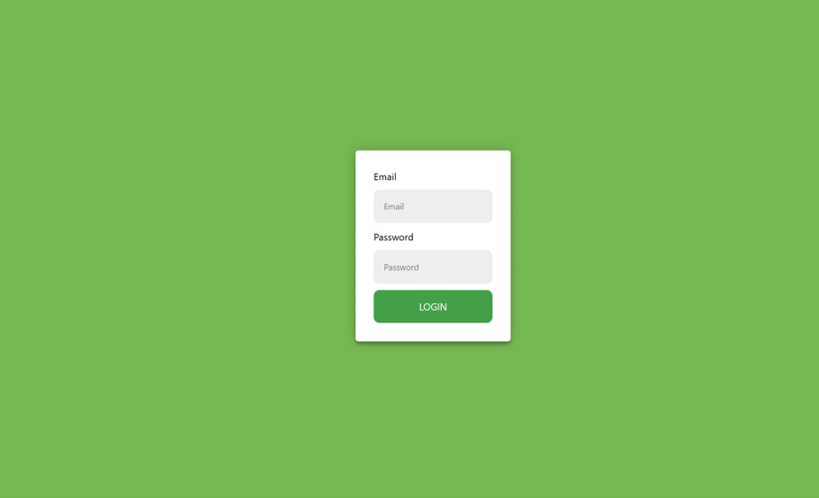
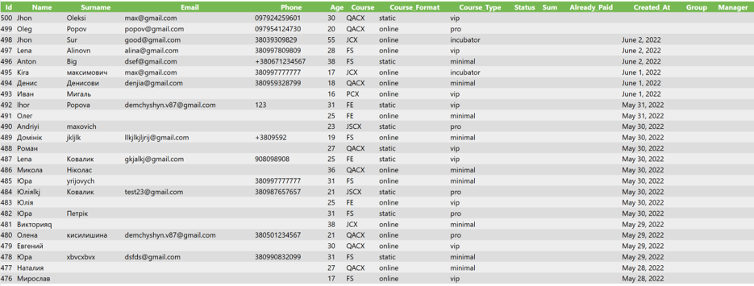
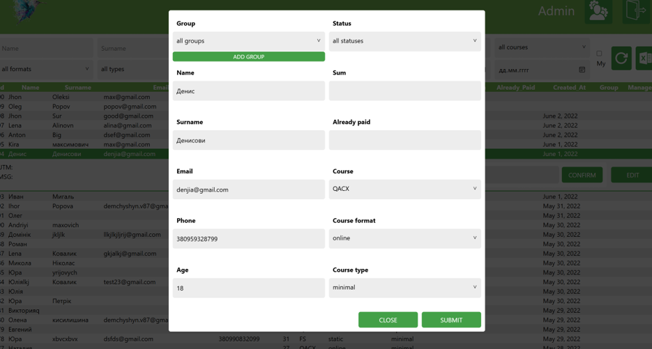
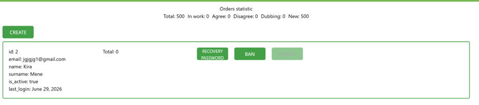

# CRM — Course-Sales Lead Management Platform

A CRM system for managing course-sales leads ("orders") end to end: capture leads through a public form, triage and work them through a status pipeline, keep a comment history on every lead, and manage staff, roles, and groups — all behind a JWT-authenticated Express API with a Next.js front end.

## Screenshots

> Screenshots will be added here. Drop image files into `docs/screenshots/` and they will render below.

| Login | Orders list |
| --- | --- |
|  |  |

| Order detail & comments | User management |
| --- | --- |
|  |  |

## Key Features

- **Public lead capture** — anyone can submit a lead through the `POST /orders` endpoint, no authentication required.
- **JWT authentication** — short-lived access tokens plus a refresh-token flow.
- **Role-based access control** — `admin` and `manager` roles with different permissions.
- **Order lifecycle** — leads move through `New → In work → Agree / Disagree / Dubbing`, with manager assignment and reassignment protection.
- **Comment history** — a per-order activity log so managers can track every interaction with a lead.
- **Groups** — simple named collections for organizing leads/users.
- **Excel export** — export the filtered orders list to `.xlsx`.
- **Account lifecycle emails** — admin-triggered account activation and password recovery via signed, expiring links.

## Tech Stack

| Layer | Technologies |
| --- | --- |
| Backend | Node.js, TypeScript, Express, MongoDB (Mongoose), JWT, Joi, bcrypt |
| Frontend | Next.js, React, TypeScript, Tailwind CSS, axios |
| Infra | Docker Compose, nginx (reverse proxy) |

## Architecture

nginx is the single public entry point (port `8080`). It routes `/` to the Next.js frontend and `/api/` to the Express backend (stripping/adding the `/api` prefix — the backend itself is mounted unprefixed). The backend talks to MongoDB.

```
                      ┌────────────────────────┐
 client ──▶ nginx:8080 │ /       → frontend:5000 │
                      │ /api/   → backend:5000  │
                      └────────────────────────┘
                              │            │
                              ▼            ▼
                     Next.js frontend   Express backend
                                              │
                                              ▼
                                          MongoDB
```

## Project Structure

```
.
├── backend/            Express + TypeScript API (see backend/README.md)
├── frontend/            Next.js client application
├── docker-compose.yml   Orchestrates frontend, backend, and nginx
├── nginx.conf           Reverse-proxy routing for the compose "web" service
└── .env.example         Template for the required environment variables
```

## Getting Started

### Prerequisites

- [Docker](https://www.docker.com/) and Docker Compose
- Node.js (only needed if you want to run an app outside Docker) and a MongoDB instance

### Quick start (Docker Compose)

```bash
git clone <repository-url>
cd CRM
cp .env.example .env
# fill in the values in .env — see Environment Variables below
docker compose up --build
```

The app is then available at **http://localhost:8080** (nginx routes `/` to the frontend and `/api/` to the backend).

### Running the apps individually (without Docker)

See [`backend/README.md`](backend/README.md) and [`frontend/README.md`](frontend/README.md) for instructions on running each app standalone during local development.

## Environment Variables

All variables are defined in [`.env.example`](.env.example) at the repo root and are shared by every service via `env_file` in `docker-compose.yml`.

| Variable | Description |
| --- | --- |
| `PORT` | Port the backend Express server listens on internally |
| `MONGO_URI` | MongoDB connection string |
| `JWT_ACCESS_SECRET` | Signing secret for access tokens |
| `JWT_REFRESH_SECRET` | Signing secret for refresh tokens |
| `JWT_ACCESS_LIFETIME` | Access token lifetime |
| `JWT_REFRESH_LIFETIME` | Refresh token lifetime |
| `JWT_ACTIVATE_SECRET` | Signing secret for account-activation links |
| `JWT_ACTIVATE_LIFETIME` | Expiry for account-activation links |
| `JWT_RECOVERY_SECRET` | Signing secret for password-recovery links |
| `JWT_RECOVERY_LIFETIME` | Expiry for password-recovery links |
| `FRONTEND_URL` | Base URL used when building activation/recovery links sent by email |

## API Overview

The API is mounted at `/api` (via nginx) and split into four resources:

| Resource | Base path | Access |
| --- | --- | --- |
| Auth | `/auth` | Public sign-in/refresh; admin-triggered activation & recovery |
| Users | `/users` | Admin only |
| Groups | `/groups` | Authenticated |
| Orders (+ Comments) | `/orders` | Create is public (lead capture); read/update/comment require auth, with manager-assignment restrictions |

For the full endpoint reference (exact routes, middleware chains, and request/response shapes), see [`backend/README.md`](backend/README.md).

Interactive Swagger/OpenAPI documentation is served by the backend at `/docs` (i.e. **http://localhost:8080/api/docs/** via nginx, or directly on the backend's port **http://localhost:5000/docs/**).

## Roles & Access Control

- **admin** — manages users (create, update, role changes, block/unblock), triggers account activation and password recovery emails, and has unrestricted access to orders and groups.
- **manager** — works orders assigned to them; an unassigned order can be claimed by updating/commenting on it, after which further updates/comments are restricted to that manager.

